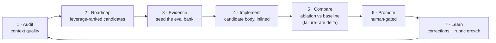

# The improvement loop — overview

> **External-share excerpt** (2026-08-10) of Bamboo's internal design doc for the marketing-agent improvement stack ("CMAstack" = Cowork Marketing Agent stack). This is the context `audit-agent` cites; the full doc is internal. Customer identifiers anonymized.

## The problem

Customers arrive with an agent that already exists — typically a Claude Cowork project with a hand-written skill (the reference case: a pilot customer's weekly dashboard, a ~600-line skill authored by the customer's own operator). It works, sort of. Nobody can say how well, what to fix first, or whether a change made it better.

Three things are missing, and they compound:

- **No diagnosis.** "It's not great" isn't actionable. Which part is wrong, and how much does it matter?
- **No baseline.** Without a measure, "improvement" is a claim, not a result.
- **No safe way to change it.** The agent is live and customer-facing. Editing it in place risks a real client relationship, and a bad output can't be un-sent.

The commercial stakes sharpen this: marketers distrust AI because the pitch is vibes. *"We cut failures on your weekly report from 30% to 8%, here's the case that used to fail"* is a fundamentally different conversation from *"the new version is better."* The loop exists to make the first sentence sayable.

## The loop

Two tracks run inside it:

- **Track 1 — candidate hillclimb.** Audit proposes and ranks candidates → author one → test against the rubric → read the failure-rate delta → iterate or promote → next.
- **Track 2 — rubric growth.** Human review of outputs induces new criteria and new cases, so the measure sharpens as the agent improves.

Reading notes: boxes 1–2 are **one skill** (`audit-agent`) — the roadmap is a step *inside* the audit, not a separate object. Box 4→5 is really two lanes — findings the test harness can't observe (`ab_testable: no`) skip 5 and ship as small human-reviewed diffs. The loop has two entry points — an existing agent (the common case) enters at box 1; only a net-new agent gets an authoring step before it.

**Two guardrails, or the loop flatters itself:**

- **Overfitting brake (Track 1).** Keep a held-out slice the human doesn't see while iterating, and bound the iteration — otherwise you hillclimb the rubric rather than reality. Track 2's fresh cases are the counterforce.
- **Circularity trap (Track 2).** Rubric edits are human-gated and independent of any in-flight candidate. Never let the player edit the scoreboard.

## What `audit-agent` needs from this

- The subject is **context quality**, not structural completeness. "It has no brain" is known and boring; grade what exists and how it's wired.
- The destination is a **compass, not a conformance checklist**. An agent doesn't have to arrive at all of it to be better than it was, and the audit may conclude the compass is wrong for a specific brand.
- Findings feed a **comparison engine that already exists** — the audit produces candidates for it, not a test harness of its own.
